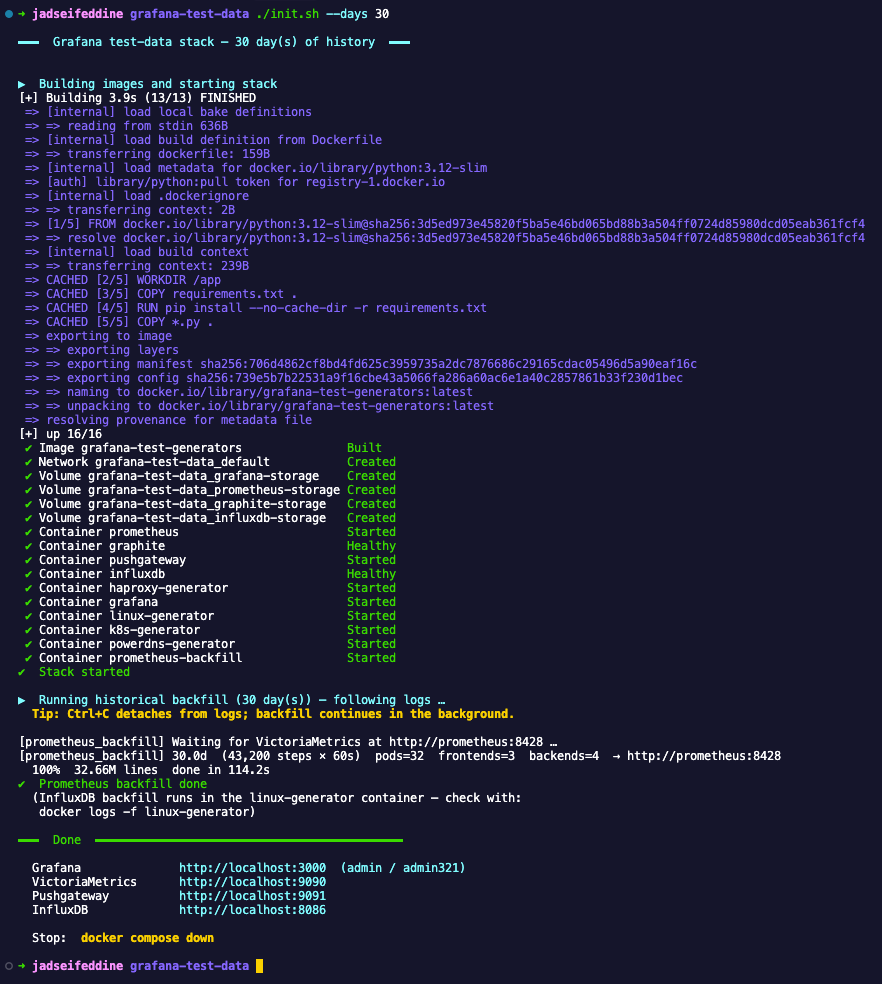
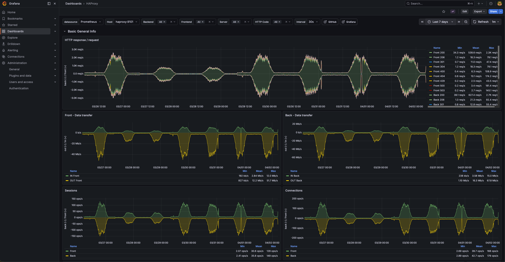
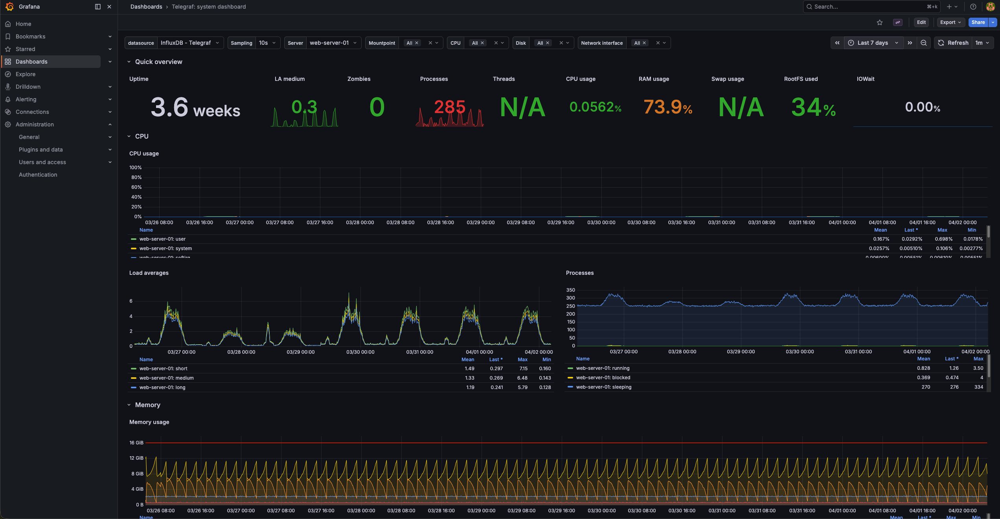
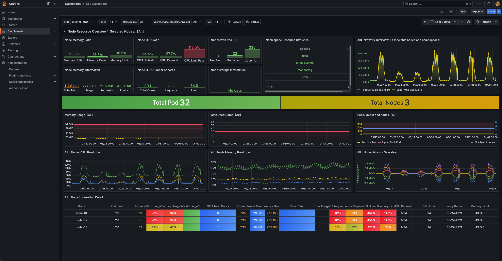
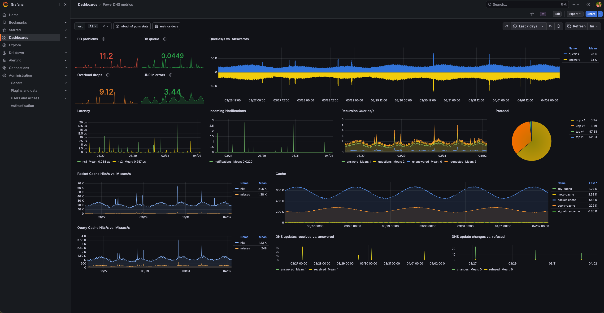

# grafana-test-data

A self-contained Grafana demo environment. Clone it, run one command, open
a browser — four production-style dashboards are already populated with
realistic historical data.

Everything runs in Docker. No local Python or database setup required.

---

## Quick start



```bash
git clone https://github.com/jseifeddine/grafana-test-data.git
cd grafana-test-data
./init.sh
```

Open **http://localhost:3000** — log in with `admin / admin321`.

All four dashboards are populated with data from the moment the stack starts.

### Options

```bash
./init.sh --days 30   # 30 days of history  (~8 min)
./init.sh --days 1    # 1 day — quick smoke-test  (~30 s)
```

### Stop

```bash
docker compose down
```

Wipe stored data and start fresh:

```bash
docker compose down -v   # removes named volumes
./init.sh
```

---

## Dashboards

### HAProxy Overview
Simulates a production load balancer: 3 frontends → 4 backends → 10 servers.

- Request/response rates with per-HTTP-status-code breakdown
- Bandwidth in/out (bits/s)
- Active sessions, connection rates, response times
- Server health — one backend server randomly flaps DOWN for ~90 s every few hours



### Telegraf: Linux System
Simulates two Linux servers (`web-server-01`, `web-server-02`).

- CPU utilisation (per-core + total), load average
- Memory, swap, process counts
- Disk usage & I/O throughput
- Network traffic, TCP state breakdown, file descriptors



### Kubernetes Cluster Overview
Simulates a 3-node cluster with ~32 pods across 6 namespaces.

- Node capacity vs. pod resource requests/limits
- Pod/namespace/workload counts (deployments, daemonsets, statefulsets)
- Container CPU & memory utilisation over time
- Network in/out per namespace
- PVC usage



### PowerDNS Authoritative
Simulates two authoritative nameservers (`ns1`, `ns2`) writing to Graphite via the Carbon plaintext protocol.

- Query rate (UDP + TCP, IPv4 + IPv6 breakdown)
- Packet-cache and query-cache hit/miss rates
- Response latency (µs) — rises under load, spikes during DB slow-query events
- SERVFAIL rate — rare background noise with occasional backend-issue storms
- Incoming NOTIFY messages and DDNS update activity
- Cache size gauges (packet, query, key, meta, signature caches)



---

## Architecture

```
┌──────────────────────────────────────────────────────────────────────┐
│  docker compose                                                      │
│                                                                      │
│  ┌──────────┐  ┌──────────────────┐  ┌─────────────┐  ┌──────────┐  │
│  │  Grafana │─▶│  VictoriaMetrics │  │  InfluxDB   │  │ Graphite │  │
│  │  :3000   │  │  :9090  (8428)   │  │  :8086      │  │  :8180   │  │
│  └──────────┘  └────────▲─────────┘  └──────▲──────┘  └────▲─────┘  │
│                          │ scrape             │ write        │ carbon │
│                 ┌────────┴─────────┐  ┌──────┴──────┐  ┌────┴──────┐ │
│                 │   Pushgateway    │  │   linux-    │  │ powerdns- │ │
│                 │   :9091          │  │  generator  │  │ generator │ │
│                 └────────▲─────────┘  └─────────────┘  └───────────┘ │
│                    push  │                                            │
│            ┌─────────────┴────────────┐                              │
│            │  haproxy-generator       │                              │
│            │  k8s-generator           │                              │
│            └──────────────────────────┘                              │
│                                                                      │
│  prometheus-backfill  (runs once, then exits)                        │
└──────────────────────────────────────────────────────────────────────┘
```

**Why VictoriaMetrics instead of plain Prometheus?**
VictoriaMetrics exposes `/api/v1/import/prometheus` — an endpoint that accepts
Prometheus text format with millisecond timestamps. The `prometheus-backfill`
container uses this to inject N days of history in one shot, rather than
waiting for live scrapes to accumulate.

---

## Services

| Container | Image | Port | Role |
|---|---|---|---|
| `grafana` | grafana/grafana-enterprise | 3000 | Dashboard UI |
| `prometheus` | victoriametrics/victoria-metrics | 9090 | Metrics store + PromQL |
| `pushgateway` | prom/pushgateway | 9091 | Metrics ingestion point |
| `influxdb` | influxdb:1.8 | 8086 | Time-series store for Telegraf data |
| `graphite` | graphiteapp/graphite-statsd | 2003 / 8180 | Carbon receiver + Graphite HTTP API |
| `haproxy-generator` | *(built locally)* | — | Pushes HAProxy metrics every 15 s |
| `k8s-generator` | *(built locally)* | — | Pushes K8s/cAdvisor metrics every 15 s |
| `linux-generator` | *(built locally)* | — | Writes Linux system metrics every 30 s |
| `powerdns-generator` | *(built locally)* | — | Writes PowerDNS metrics via Carbon every 60 s |
| `prometheus-backfill` | *(built locally)* | — | One-shot: injects historical Prometheus data, then exits |

All four generator containers are built from `generators/Dockerfile`
(a `python:3.12-slim` image with only `requests` installed).

---

## File layout

```
.
├── compose.yml
├── init.sh                           Entry-point — run this
├── prometheus/
│   └── prometheus.yml                VictoriaMetrics scrape config
├── graphite/
│   ├── storage-schemas.conf          1-min / 30-day retention for pdns.*
│   └── storage-aggregation.conf      last-value rollup for counter metrics
├── provisioning/
│   ├── dashboards/dashboards.yaml    Grafana dashboard provisioning
│   └── datasources/
│       ├── prometheus.yaml           UID: prometheus-main
│       ├── influxdb.yaml             UID: bdxkgrpteayo0d
│       └── graphite.yaml             UID: graphite-main
├── dashboards/
│   ├── haproxy.json
│   ├── k8s-dashboard.json
│   ├── telegraf-linux-system.json
│   └── powerdns.json
└── generators/
    ├── Dockerfile
    ├── requirements.txt              requests only
    ├── haproxy_generator.py
    ├── k8s_generator.py
    ├── linux_generator.py
    ├── powerdns_generator.py
    └── prometheus_backfill.py
```

---

## Viewing generator logs

```bash
docker compose logs -f haproxy-generator
docker compose logs -f k8s-generator
docker compose logs -f linux-generator
docker compose logs -f powerdns-generator
docker compose logs -f prometheus-backfill   # exits when backfill is done
```
